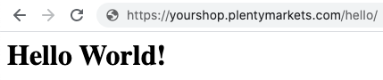
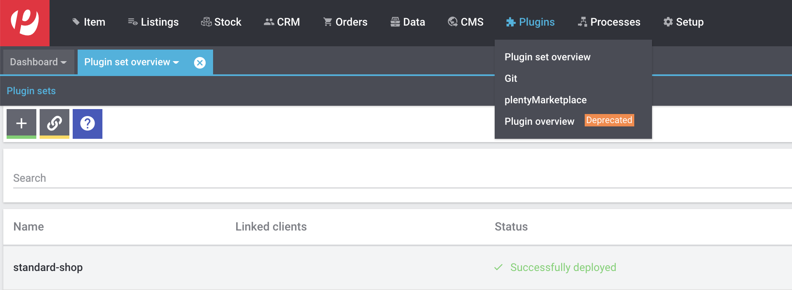
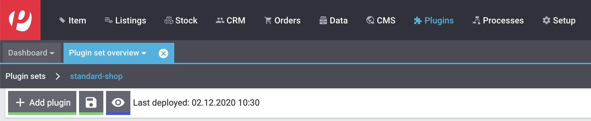
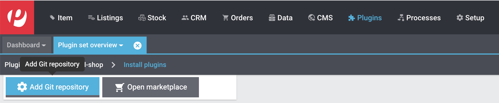
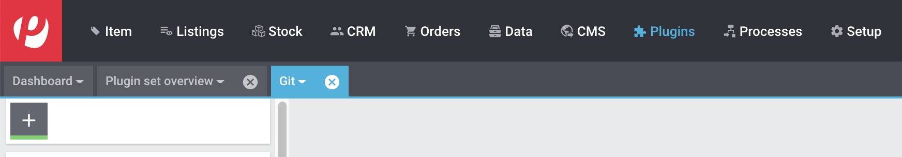
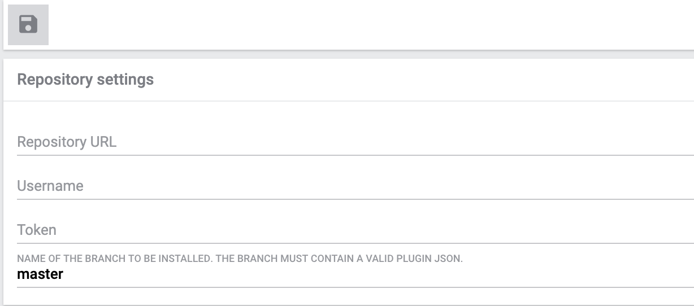
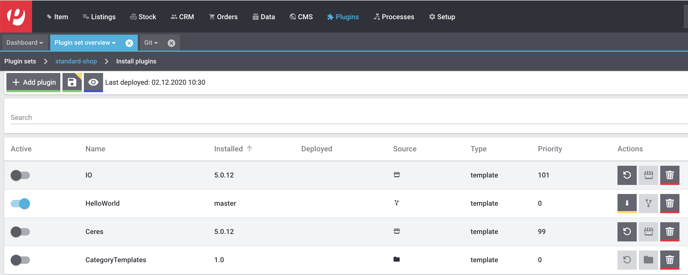

= Hardware and Software Requirements
:page-layout: default

Author Name
:idprefix:
:idseparator: -
:!example-caption:
:!table-caption:
:page-pagination:

Platonem complectitur mediocritatem ea eos.
Ei nonumy deseruisse ius.
Mel id omnes verear.
Vis no velit audiam, sonet <<dependencies,praesent>> eum ne.
*Prompta eripuit* nec ad.
Integer diam enim, dignissim eget eros et, ultricies mattis odio.
Vestibulum consectetur nec urna a luctus.
Quisque pharetra tristique arcu fringilla dapibus.
Curabitur ut massa aliquam, cursus enim et, accumsan lectus.

dadasdd

= heading here1
== heading here2
=== heading here3
==== heading here4
===== heading here5
====== heading here6

Nominavi luptatum eos, an vim hinc philosophia intellegebat.
Lorem pertinacia `expetenda` et nec, [.underline]#wisi# illud [.line-through]#sonet# qui ea.
Eum an doctus <<liber-recusabo,maiestatis efficiantur>>.
Eu mea inani iriure.

[source,json]
----
{
  "name": "module-name",
  "version": "10.0.1",
  "description": "An example module to illustrate the usage of package.json",
  "author": "Author Name <author@example.com>",
  "scripts": {
    "test": "mocha",
    "lint": "eslint"
  }
}
----

.Example paragraph syntax
[source,asciidoc]
----
.Optional title
[example]
This is an example paragraph.
----

.Optional title
[example]
This is an example paragraph.

=== Some Code

How about some code?

[source,js]
----
vfs
  .src('js/vendor/*.js', { cwd: 'src', cwdbase: true, read: false })
  .pipe(tap((file) => { // <1>
    file.contents = browserify(file.relative, { basedir: 'src', detectGlobals: false }).bundle()
  }))
  .pipe(buffer()) // <2>
  .pipe(uglify())
  .pipe(gulp.dest('build'))
----
<1> The tap function is used to wiretap the data in the pipe.
<2> Wrap each streaming file in a buffer so the files can be processed by uglify.
Uglify can only work with buffers, not streams.

Cum dicat #putant# ne.
Est in <<inline,reque>> homero principes, meis deleniti mediocrem ad has.
Altera atomorum his ex, has cu elitr melius propriae.
Eos suscipit scaevola at.

....
pom.xml
src/
  main/
    java/
      HelloWorld.java
  test/
    java/
      HelloWorldTest.java
....

Eu mea munere vituperata constituam.

[%autowidth]
|===
|Input | Output

m|"foo\nbar"
l|foo
bar
|===

Select menu:File[Open Project] to open the project in your IDE.
Per ea btn:[Cancel] inimicus.
Ferri kbd:[F11] tacimates constituam sed ex, eu mea munere vituperata kbd:[Ctrl,T] constituam.

.Sidebar Title
****
Platonem complectitur mediocritatem ea eos.
Ei nonumy deseruisse ius.
Mel id omnes verear.

Altera atomorum his ex, has cu elitr melius propriae.
Eos suscipit scaevola at.
****

=== Liber recusabo

No sea, at invenire voluptaria mnesarchum has.
Ex nam suas nemore dignissim, vel apeirian democritum et.
At ornatus splendide sed, phaedrum omittantur usu an, vix an noster voluptatibus.

. potenti donec cubilia tincidunt
. etiam pulvinar inceptos velit quisque aptent himenaeos
. lacus volutpat semper porttitor aliquet ornare primis nulla enim

Natum facilisis theophrastus an duo.
No sea, at invenire voluptaria mnesarchum has.

* ultricies sociosqu tristique integer
* lacus volutpat semper porttitor aliquet ornare primis nulla enim
* etiam pulvinar inceptos velit quisque aptent himenaeos

Eu sed antiopam gloriatur.
Ea mea agam graeci philosophia.

* [ ] todo
* [x] done!

Vis veri graeci legimus ad.

sed::
splendide sed

mea::
agam graeci

At ornatus splendide sed.

.Library dependencies
[#dependencies%autowidth]
|===
|Library |Version

|eslint
|^1.7.3

|eslint-config-gulp
|^2.0.0

|expect
|^1.20.2

|istanbul
|^0.4.3

|istanbul-coveralls
|^1.0.3

|jscs
|^2.3.5
|===

Cum dicat putant ne.
Est in reque homero principes, meis deleniti mediocrem ad has.
Altera atomorum his ex, has cu elitr melius propriae.
Eos suscipit scaevola at.

[TIP]
This oughta do it!

Cum dicat putant ne.
Est in reque homero principes, meis deleniti mediocrem ad has.
Altera atomorum his ex, has cu elitr melius propriae.
Eos suscipit scaevola at.

[NOTE]
====
You've been down _this_ road before.
====

Cum dicat putant ne.
Est in reque homero principes, meis deleniti mediocrem ad has.
Altera atomorum his ex, has cu elitr melius propriae.
Eos suscipit scaevola at.

[WARNING]
====
Watch out!
====

[CAUTION]
====
[#inline]#I wouldn't try that if I were you.#
====

[IMPORTANT]
====
Don't forget this step!
====

.Key Points to Remember
[TIP]
====
If you installed the CLI and the default site generator globally, you can upgrade both of them with the same command.

 $ npm i -g @antora/cli @antora/site-generator-default
====

Nominavi luptatum eos, an vim hinc philosophia intellegebat.
Eu mea inani iriure.

[discrete]
== Voluptua singulis

Cum dicat putant ne.
Est in reque homero principes, meis deleniti mediocrem ad has.
Ex nam suas nemore dignissim, vel apeirian democritum et.

.Antora is a multi-repo documentation site generator

Make the switch today!

[#english+中文]
== English + 中文

Altera atomorum his ex, has cu elitr melius propriae.
Eos suscipit scaevola at.

[quote, 'Famous Person. Cum dicat putant ne.', 'Cum dicat putant ne. https://example.com[Famous Person Website]']
____
Lorem ipsum dolor sit amet, consectetur adipiscing elit.
Mauris eget leo nunc, nec tempus mi? Curabitur id nisl mi, ut vulputate urna.
Quisque porta facilisis tortor, vitae bibendum velit fringilla vitae! Lorem ipsum dolor sit amet, consectetur adipiscing elit.
Mauris eget leo nunc, nec tempus mi? Curabitur id nisl mi, ut vulputate urna.
Quisque porta facilisis tortor, vitae bibendum velit fringilla vitae!
____

Lorem ipsum dolor sit amet, consectetur adipiscing elit.

[verse]
____
The fog comes
on little cat feet.
____

[#helloworld]
== Hello World Tutorial

=== A Simple Route

This tutorial is aimed at plentymarkets users who are getting started with plugin development. You will only need basic knowledge of creating and editing files in an integrated development environment (IDE) as well as using plentymarkets.

[IMPORTANT]
====
You need to prepare your computer to program a plugin. If you don't know how, please take a look link:index.html[here]!
Furthermore you should be able to use git and Github to publish your plugin. link:index.html[Here] you can find tutorials.
====

[quote, ' Cory House']
____
Code is like humor. When you have to explain it, it’s bad.
____

In a few simple steps, we will walk you through creating your first plugin that displays Hello World! in your browser when adding `/hello` to your domain.

.What an incredible technology!

There are often people who like to rush things, and if you are one of them. We totally understand. You can just download
the link:https://github.com/plentymarkets/plugin-hello-world2[github repository] and try to figure yourself out what the code means. Otherwise, stay tuned and keep following the next 3 steps!

=== First File

The first thing that we are going to do is create a json, which contains all information about our plugin, that we need.
[source,json]
----
{
      "name":"HelloWorld", <1>
      "description":"My first plugin", <2>
      "namespace":"HelloWorld", <3>
      "author":"plentysystems AG", <4>
      "type":"template", <5>
      "serviceProvider":"HelloWorld\\Providers\\HelloWorldServiceProvider" <6>
}
----
<1> This is the name of our plugin. This is also how it will be displayed in the repository.
<2> A description for our plugin
<3> We recommend that you use the name of the plugin folder as the namespace root. This service provider is the central location to register services in the plugin.
<4> The Author of the plugin, your company name or your personal name.
<5> The type of the plugin, for now accept, that this is a template, there are also other type, which we will explain later.
<6> The namespace of our ServiceProvider (We haven't created it yet)

=== Folder Structure

Furthermore we will now present you the structure including all the files, that we will need for our Hello World Plugin.

....
HelloWorld/ <1>
  resources/
    views/
      content/
        hello.twig <2>
  src/
    Providers/
      HelloWorldRouteServiceProvider.php
      HelloWorldServiceProvider.php
    Controllers/
      ContentController.php
  plugin.json
....
<1> We recommend calling your Folder the same way that you called your Plugin in the plugin.json
<2> You can organize your twig templates in subfolders

==== Explanation of all Components

We need a few files to establish the possibility for communication between your plugin and plentymarkets.

- `HelloWorldServiceProvider.php` is our ServiceProvider. It is needed to register the plugin within the plentymarkets backend.

- `HelloWorldRouteServiceProvider.php` is our RouteServiceProvider. It creates and registers the output route.

- `ContentController.php` renders and displays the content in your template. For us this will be the `hello.twig`

==== Our Output

Let's define what we want to present the user, that comes to our specified route: In out case it's a simple Hello World.

.hello.twig
[source,html]
----
<h1>Hello World!</h1>
----

==== Real Coding

So let's take a look at the Files, that actually do something. We will paste the Source Code and write Explanations to
specific code Fragments.

.ContentController.php
[source%linenums,php,linenums]
----
<?php
namespace HelloWorld\Controllers;

use Plenty\Plugin\Controller;
use Plenty\Plugin\Templates\Twig;

/**
 * Class ContentController
 * @package HelloWorld\Controllers
 */
class ContentController extends Controller
{
	/**
	 * @param Twig $twig
	 * @return string
	 */
	public function sayHello(Twig $twig):string <1>
	{
		return $twig->render('HelloWorld::content.hello');
	}
}
----

<1> In this code example, we define the `sayHello` function that renders a twig template. The render method specifies the template location: `'PLUGINNAME::TEMPLATE'`. Since templates are always saved in the resources/views folder in your plugin, we only have to specify part of the template path. Note that `PLUGINNAME` is the name of the plugin folder. The name of the plugin folder and the plugin namespace may differ.

.HelloWorldRouteServiceProvider.php
[source%linenums,php,linenums]
----
<?php
namespace HelloWorld\Providers;

use Plenty\Plugin\RouteServiceProvider;
use Plenty\Plugin\Routing\Router;

/**
 * Class HelloWorldRouteServiceProvider
 * @package HelloWorld\Providers
 */
class HelloWorldRouteServiceProvider extends RouteServiceProvider
{
	/**
	 * @param Router $router
	 */
	public function map(Router $router)
	{
		$router->get('hello', 'HelloWorld\Controllers\ContentController@sayHello'); <1>
	}

}
----

<1> We use the get method to pass two parameters. The first parameter 'hello' defines the route. The second parameter consists of the Fully-Qualified Class Name and the @ controller method that is called when the route is called.

.HelloWorldServiceProvider.php
[source%linenums,php,linenums]
----
<?php
namespace HelloWorld\Providers;

use Plenty\Plugin\ServiceProvider;

/**
 * Class HelloWorldServiceProvider
 * @package HelloWorld\Providers
 */
class HelloWorldServiceProvider extends ServiceProvider
{

	/**
	 * Register the service provider.
	 */
	public function register()
	{
		$this->getApplication()->register(HelloWorldRouteServiceProvider::class); <1>
	}
}
----

<1> This line registers the `HelloWorldRouteServiceProvider` with our application. This means the RouteServiceProvider will map our route to your plentyshop. Therefore the circle is complete. Coding is done 😎. Commit your repository to your github repo.

=== Integrate your Plugin into your Shop

After pushing the code to your github repository, you need the full Github URL and your login Credentials.

. Open the plentymarkets back end. Click on Plugins->Plugin set overview and on your shop name.

+

. Now click on `+ Add plugin`

+

. Now click on `Add Git repository`

+

. Click on the `+` Button.

+

. In this following field you can enter your Repository URL, your Username and your link:https://docs.github.com/en/free-pro-team@latest/github/authenticating-to-github/creating-a-personal-access-token[Github Token]. When you are done, press the save icon.

+

. You are almost done. In the Pluginset overview activate the toggle next to the HelloWorld Plugin (if it does not appear reload the current browser window). Click on the save icon, to deploy the current pluginset. When this is done click on the eye-icon to preview your current pluginset in the shop.

+

. In the opened Shop, add the `/hello` route to the URL and...

+
.What a result
image::helloworld.png[Hello World example,500]

Congratulations. Your first plugin has been deployed. If you have any questions, don't hesitate to contact us through our
link:https://forum.plentymarkets.com/[forum]
